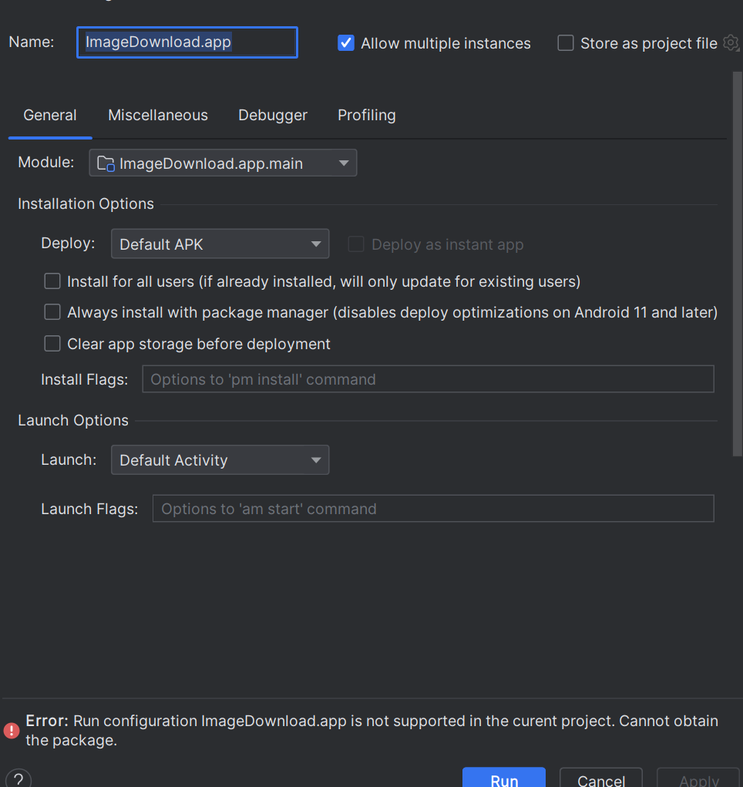

# Download Image Projekt

## Beschreibung
Dieses Projekt ermöglicht das Herunterladen und Anzeigen eines Bildes in einer Android-Anwendung. Benutzer können auf einen Download-Button klicken, um das Bild herunterzuladen, und einen Löschen-Button, um das Bild aus dem Speicher zu entfernen.

## Wichtigste Funktionen

- `downloadImage(url: String, fileName: String)`: Diese Funktion wird aufgerufen, wenn der Benutzer auf den Download-Button klickt. Sie lädt das Bild von der angegebenen URL herunter und speichert es im lokalen Speicher des Geräts.
- `deleteImage(fileName: String)`: Diese Funktion wird aufgerufen, wenn der Benutzer auf den Löschen-Button klickt. Sie entfernt das heruntergeladene Bild aus dem lokalen Speicher.
- `CoroutineScope(Dispatchers.IO)`: Wird verwendet, um Netzwerkanfragen im Hintergrundthread auszuführen, um die Benutzeroberfläche nicht zu blockieren.
- `runOnUiThread`: Aktualisiert die Benutzeroberfläche nach dem Herunterladen des Bildes oder beim Auftreten eines Fehlers.

## Aufgabe: Auslagerung des Downloads in einen Service

### Ziel
Die Aufgabe besteht darin, den Download-Prozess in einen Android-Service auszulagern. Der Service soll durch den Download-Button gestartet werden und sich selbst beenden, sobald der Download abgeschlossen ist.

### Schritte

1. **Erstellung des Services**: Erstellen Sie eine neue Klasse, die `IntentService` erweitert. In dieser Klasse implementieren Sie die Logik zum Herunterladen des Bildes.

2. **Service Starten**: Modifizieren Sie die `downloadImage` Funktion, sodass sie einen Intent erstellt und an den Service sendet, um den Download zu starten.

3. **Download im Service**: Im Service, verwenden Sie die übergebenen Informationen (z.B. URL und Dateiname) aus dem Intent, um das Bild herunterzuladen.

4. **Service Beenden**: Nach Abschluss des Downloads sollte der Service sich selbst beenden. Da `IntentService` automatisch beendet wird, wenn keine Startanfragen mehr vorliegen, müssen Sie sich darüber keine weiteren Gedanken machen.

5. **Benachrichtigung über den Download**: Optional können Sie eine Benachrichtigung anzeigen, um den Benutzer über den Beginn und das Ende des Downloads zu informieren.

### Zusätzliche Überlegungen

- Stellen Sie sicher, dass der Service die erforderlichen Berechtigungen für den Internetzugang und den Zugriff auf den lokalen Speicher hat.
- Beachten Sie, wie Sie den Status des Downloads zurück an die Activity kommunizieren, um die Benutzeroberfläche entsprechend zu aktualisieren.

 - wie zu sehen funktioniert das builden des Programmes nicht, weswegen das Testen auf dem Emulator nicht möglich war.
 - Eventuell liegt es an anderen Android Studio Versionen, da die Anleitung nicht mehr aktuell ist, oder wegen Mac/Windows Unterschieden.